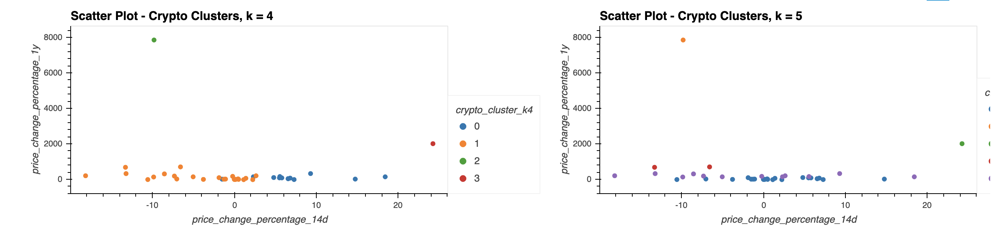

# Crypto Portfolio - Unsupervised Machine Learning

As an advisor in one of the top 5 financial advisory firms in the world, your goal is to combine your financial Python programming skills with  your unsupervised learning skills. In order to stand out from the competition, you'll want to propose a novel approach to assembling investment portfolios that are based on cryptocurrencies. Instead of basing your proposal on only returns and volatility, you want to include other factors that might impact the crypto market—leading to better performance for your portfolio.

---

## Technologies

This project leverages python 3.7 with the following packages:

* [scikit-learn](https://scikit-learn.org/stable/) - A free software machine learning library for the Python programming language.

---

## Installation Guide

The scikit-learn library is automatically installed with Anaconda.

If your terminal does not display scikit-learn and you need to install it, run the following:
    
	pip install -U scikit-learn
    

---

## Usage

You’ll create a Jupyter notebook that clusters cryptocurrencies by their performance in different time periods. You’ll then plot the results so that you can visually show the performance to the board.

The detailed instructions are divided into the following parts:

1) Import the Data

2) Prepare the Data

3) Cluster Cryptocurrencies with K-means

4) Find the Best Value for k

5) Optimize Clusters with Principal Component Analysis

6) Visualize the Results

#####  After optimizing clusters with CPA, your visualization should looks like the following:

---

## Contributors

Brought to you by Edgar Coronado

---

## License

MIT